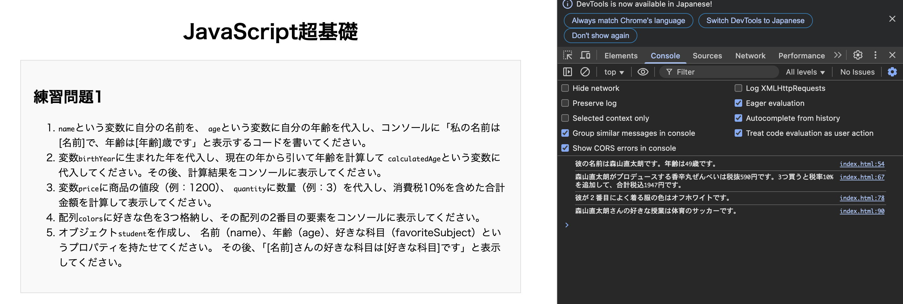

# Web開発学習プロジェクト

## 📁 ディレクトリ構成

- `work/` - 学習記録や進捗管理用フォルダ
  - `work_log.md` - 日々の学習記録と進捗管理
  - `time_log.md` - 作業時間の詳細記録
  - `mentor_notes.md` - 学習過程で得た重要な知見やアドバイスの記録
  - `learning_roadmap.md` - リポジトリロードマップ、学習計画
  - `skill_checklist.md` - リポジトリ内での習得スキルのチェックリスト
- `web-basics/` - Web開発の基礎学習教材
  - HTML、CSS、JavaScriptの基礎知識
  - 実践的な例題とサンプルコード
  - 各言語の専門用語集
- `practice/` - 課題フォルダ
  - 教材内の課題、自主課題
  - 完成日をファイル名の前に記載している
- `memo/` - メモや辞書など参照用ファイル
  - `tech_glossary.md` - 技術用語・ショートカット辞典
  - `memo_study.md` - 学習ノート
  - `memo_followup.md` - 師匠への確認事項と自分で調べることのフォローアップ記録
- `.cursorrules` - AIとのコミュニケーションルール設定ファイル

## 📝 作業ログについて
`work`フォルダ内の以下のファイルで学習記録を管理しています：

- **`time_log.md`**: 作業時間の詳細記録
  - 総合計勉強時間
  - 日次記録・週間サマリー

- **`work_log.md`**: 作業内容の詳細記録
  - 完了したタスク・学んだこと
  - 次回の予定
  - メモ・気づき
  - 新しい記録は上部に追加

- **`mentor_notes.md`**: 師匠から得た知見やアドバイス
  - メンターへの質問内容とその回答
  - メンターから得た実践的なテクニック

これらの記録は、学習の進捗を可視化し、継続的な改善を促進するために活用します。

## 🗂 学習教材
詳細な学習内容は `web-basics/` ディレクトリ内のドキュメントを参照してください。
すべての教材には専門用語集が付いており、初心者でも理解しやすい構成になっています。

## 🔧 開発環境
- macOS
- Cursor IDE (Claude 3.7 Sonnetと連携)
- Google Chrome (ブラウザでの動作確認用)

## 📋 コミュニケーションルール
- Cursor IDEとAI（Claude 3.7 Sonnet）を活用した学習を進めています
- `.cursorrules`ファイルでAIとのコミュニケーションルールを設定
- 学習記録は指定のフォーマットで管理

### コマンドフレーズ一覧
- 以下のコマンドフレーズを用いて、学習記録をとりやすい工夫をしています。

| コマンドフレーズ | 動作内容 |
|-------------|----------|
| 「〇〇分の学習を開始します」 | 指定時間に合わせた学習計画を提案 |
| 「学習を開始します、（日時の記載）」 | タイムログにのみ時間と「0h00m」の合計時間を記録する。ワークログには記録しない |
| 「学習を終了します」 | 直前の「学習を開始します」で記録した時間との差分を計算し、タイムログに開始時間、終了時間、合計時間、および内容を記録する |
| 「今日はおしまい」 | その日の学習のまとめを記載 |
| 「ログをつけて」 | work_log.mdとtime_log.mdに学習記録を追記 |
| 「ルールに追加して」 | .cursorrulesにルールを追記 |
| 「師匠メモに追加して」 | mentor_notes.mdに学びや気づきを記録 |
| 「辞書に追加して」 | tech_glossary.mdに新しい用語や知識を追記 |
| 「メモに追加して」 | memo_study.mdに学習メモを追記 |
| 「確認メモに追加して」 | memo_followup.mdに「師匠へ確認してもらうこと」として記録 |
| 「IT辞書に追加して」 | ITword.mdに新しい用語や知識を追記 |
| 「ITメモに追加して」 | ITmemo.mdに新しい用語や知識を追記 |

## GitHubへの更新方針

- **重要**: GitHubへの更新（プッシュ）は明示的な指示がある場合のみ行います
- GitHubへの反映が必要な場合は「GitHubに反映して」と明示的に依頼します
- 基本的に手動でGitHub操作を行うことでバージョン管理の理解を深めています
- この方針により、変更内容を確認してから最終的にリモートリポジトリに反映できます

# 🌟 コーダー見習いのためのWeb開発入門

## 👋 はじめに
このリポジトリは、Web開発の基礎を学びたいコーダー見習いの方のために作られた学習教材です。
HTML、CSS、JavaScriptの基礎を、実践的な例を通じて学んでいきます。

## 📚 学習内容

### 1. HTML基礎 [`html-basics.md`](web-basics/html-basics.md)
- Webページの構造作り
- 基本的なタグの使い方
- 実践的な自己紹介ページの作成
- セマンティックHTMLの基礎
- HTML専門用語集

### 2. CSS基礎 [`css-basics.md`](web-basics/css-basics.md)
- デザインの基本とCSSの構文
- 文字・背景・ボックスのスタイリング
- Flexboxを使ったレイアウト
- レスポンシブデザイン
- 実践的な課題（プロフィールカード作成）
- CSS専門用語集

### 3. JavaScript基礎 [`js-basics.md`](web-basics/js-basics.md)
- JavaScriptの基本概念と構文
- 変数、条件分岐、ループ、関数
- DOM操作の基本
- イベント処理
- 実践例（スムーズスクロール、ハンバーガーメニュー）
- JavaScript専門用語集

### 4. ITパスポート資格勉強 [`ITpassport_study.md`](web-basics/ITpassport_study.md)
- ITに関する基礎的な知識
 - ITに関する基礎的な知識を体系的に学び、ITパスポートを取得することを目的とする
 - 参考書に基づいたノート、単語帳として使用する
 - このファイルを元にcursorチャットで復習問題を実践する

## 💡 学習の進め方
1. 教材（web-basics/）を参照し、練習課題を順番に進める
2. 作成したコードやタグは一つ一つ理解を深め、説明できるようにする
3. 課題完成ごとにその課題の説明を誰かにアウトプットする時間を作る
4. わからないことはその場で解決する
5. Cursorチャット欄をthinkingモードで解説AIが考えていることを理解し、AI理解を深める
6. 学んだ内容を自己紹介ページに応用していく

## 🎯 このコースの最終目標
- 基本的なWebサイトの構造を理解し実装できる
- CSSでデザインを適用できる
- JavaScriptで簡単な対話機能を実装できる
- レスポンシブデザインを考慮したページを作成できる

## 📝 注意点
- コードをコピー&ペーストするだけでなく、必ず理解しながら進める
- 実践例は自分なりにアレンジする
- エラーが出ても慌てずに、エラーメッセージを読んで対処しましょう

## 🔧 必要な準備
- テキストエディタ（Cursor推奨）
- Webブラウザ（Chrome推奨）
- やる気と好奇心！

### Mac環境での学習について
- 本教材はMacBook Airでの学習を前提に作成
- ショートカットキーやコマンドはMac仕様で記載
- Windowsユーザーは適宜読み替えて使用する

頑張りましょう！💪✨

## 📝 学習管理
詳細な学習記録は `work/time_log.md` と `work/work_log.md` で管理しています。

## 📚 学習状況

### 現在の学習フェーズ
- ロードマップの更新と学習計画の整備
- ITパスポート勉強
- JavaScriptの基礎学習

### 次のステップ
JavaScriptの基礎固め（変数、条件分岐、繰り返し処理）とカウンターアプリの作成に取り組む。

### 直近の学習実績
【2025/04/12-04/18】（今週）

| 日付 | 合計時間 | 主な学習内容 |
|------|----------|--------------|
| 4/16(火) | 2h30m | JavaScript基礎課題１２のreadme更新、課題の振り返り、練習問題3の完了、学んだことのメモ追加 |
| 4/15(火) | 1h15m | JavaScript練習問題の復習、練習問題３のファイル作成と学習、配列インデックス・switch文・二重ループの理解 |
| 4/14(月) | 0h15m | ITパスポート参考書1章企業活動通読、電車内学習習慣化の実践 |
| 4/13(日) | 6h45m | JavaScript基礎教材の作成、Javascript課題練習問題１・２の実装、ITパスポート学習（テクノロジ系）、ロードマップ振り返り、ファイル整理、JavaScript数値の小数点表示問題の解決、READMEの更新、switch文の正しい構造学習 |
| 4/12(土) | 5h00m | ロードマップの更新、ITパスポート勉強用ファイル作成、ITパスポートメモまとめ |

**週間総学習時間: 15h45m**

#### 週間所感
（週末に記載予定）

# 🎯 このリポジトリで作成した制作物

# ⑦JavaScript超基礎２：条件分岐とループ

## 完成画像

## 完成動画

## 完成日
2025/04/15

## 概要
if文、switch文、forループを使った演習に取り組みました。

- if-else文による条件分岐（気温に応じたメッセージ表示）
- switch文による季節の判定
- for文とFizzBuzz問題
- 二重ループを使った九九の表示
- 配列操作と要素の検索

## 気付き
- cursorAIに演習の復習問題をチャット上で作成してもらい取り組むことで、繰り返し自分の手でコードを書いたり内容をより深めることができた。

# ⑥JavaScript超基礎１：変数とデータ型

## 完成画像

## 完成日
2025/04/13

## 概要
JavaScriptの基礎として、変数の宣言と使用方法を学ぶ練習問題に取り組みました。

- 変数宣言と値の代入（constとletの違い）
- 文字列と数値の扱い方
- 計算と文字列連結
- 配列の作成と要素へのアクセス
- オブジェクトの作成とプロパティの取得

## 課題のポイント
内容に合わせて出力ドキュメントを考えることで、ファイル構造の理解を深めました。

## 学んだこと
- JavaScriptのデータを作るにはまず箱（変数）が必要
  - 変数宣言をする（constは定数、letは変更可能な変数）
  - 変数に値を代入する
  - 変数を呼び出して使用する
- console.log()の使い方
  - コンソールに情報を表示するためのメソッド
  - 文字列と変数の連結（+演算子または`${}`テンプレートリテラル）
- document.write()の使い方
  - Webページに直接出力するメソッド
- オブジェクトの基本構造
  - キーと値のペアでデータを構造化
  - ドット記法でプロパティにアクセス

# ⑤アコーディオンメニュー基礎

## 完成動画

## 完成日
2025/04/08

## 概要
アコーディオンメニュー基礎として、前回の課題ファイルに以下の課題を追加しました。

- 課題4：開閉状態の視覚的な表現
  - タイトル横に＋/－アイコンを追加
  - 開閉状態でアイコンを切り替え
  - ホバー効果の実装
- 課題5：アニメーション効果の追加
  - スムーズな開閉アニメーション
  - アイコンの回転アニメーション
  - CSSトランジションを使用した自然な動き

## 課題のポイント
前回のファイルをブラッシュアップすることで、ファイル構造の理解を深めました。

## 学んだこと
- アコーディオンメニューのファイル構造理解
- アコーディオンメニューの視覚的効果
- 配置を指定するCSS
- Chrome検証の活用方法

# ④アコーディオンメニュー超基礎

## 完成動画

## 完成日
2025/04/07

## 概要
アコーディオンメニュー超基礎として、以下の課題を実践しました。
- 課題1：HTML構造を作成
  - 「見出し」と「内容」の2層構造を持つHTMLを作成
  - 複数の項目を用意する
- 課題2：CSSスタイリングをする
  - 見出しをクリックできるように見せる
  - 色や枠線で装飾する
- 課題3：JavaScriptコードを実装
  - 見出しクリックで内容を表示/非表示

## 課題のポイント
前回のプロフィールカードではファイルが複雑すぎて、アコーディオンメニューの理解が追いつかなかったため実践型超基礎教材を作りました。また、自分の興味のある内容を題材として使用しました。

## 学んだこと
- アコーディオンメニューにおけるHTML基本構造
- アコーディオンメニューにおけるCSSでの基本スタイリング
- HTML内へのJavaScriptコード記載方法
- アコーディオンメニューに使うJavaScriptコードの理解

## これからの課題
- アコーディオンメニュー基礎編課題に移行
- アコーディオンメニューの基本的実装方法を習得
- CSSでページスタイルをより整えたい

# ③プロフィールカード（アコーディオン機能つき）

## 完成画面

## 完成動画

## 完成日
2025/04/06

## 概要
前回の課題にアコーディオンメニューを追加しました。カラーやフォントを変更することでCSSの理解をより深めました。また、ずれていたガイドラインを直しました。

## 学んだこと
- JavaScriptは難しい

## 課題
- CSSファイルの内容をまだ理解しきれていない
- JavaScriptは一歩ずつ丁寧に学習を進める

# ②プロフィールカード

## 完成画面

## 完成動画

## 完成日
2025/04/04

## 概要
CSSを使ってプロフィールカードを作成しました。背景色や文字色の設定、ボックスモデル、フレックスボックスなどのCSSの基本的な概念を学びました。また、レスポンシブデザインの基礎も実践しました。

## 学んだこと
- HTMLの基本構造
- CSSの基本構文とセレクタの使い方
- ボックスモデル（margin、padding、border）の理解
- Flexboxを使った要素の配置

## 課題
- CSSファイルの内容を理解しきれていない
- ガイドラインが揃っていない

# ①自己紹介ページ

## 完成画面

## 完成日
2025/03/30

## 概要
HTMLを使って自己紹介ページを作成しました。基本的なHTMLタグの使い方やリスト表示の方法を学びました。またHTMLファイル内にタグ等の解説を入れることで理解を深めました。

## 学んだこと
- HTMLの基本構造（DOCTYPE宣言、head、body）
- セマンティックタグ（header、main、section、footer）
- リストの作成（ul、ol、li）
- リストマーカーの非表示方法（list-style-type: none）
- リンクの作成方法（aタグ）  

