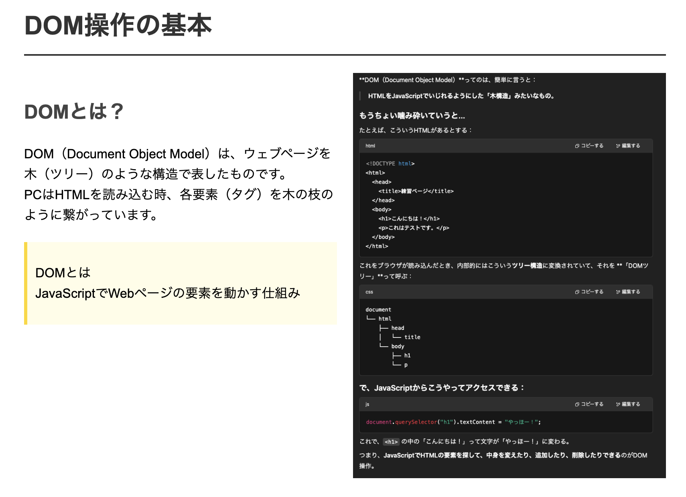
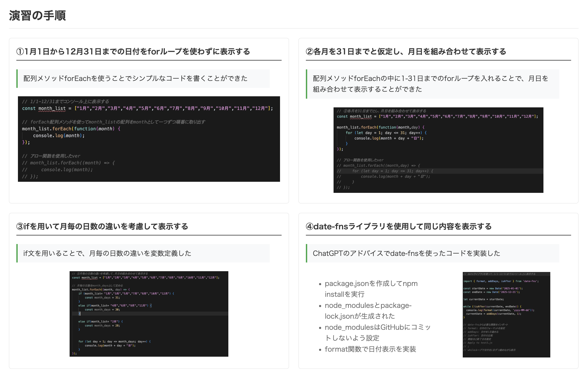
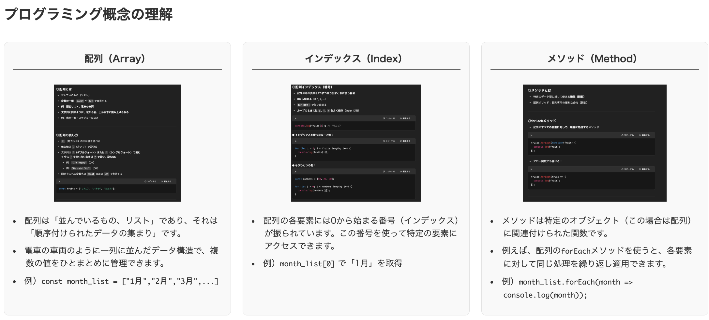
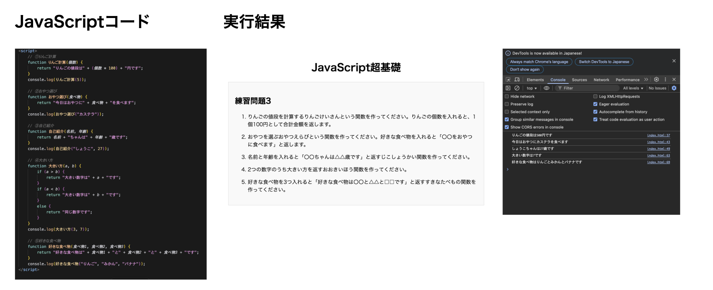

# Web学習プロジェクト
## プログラミング初心者のための100日間学習プログラム
このプロジェクトは、プログラミング初心者が一から学習を始めるための100日間の学習プログラムです。CursorAIで作成した教材と制作物プロジェクトを中心に学習を進めます。また、ITパスポートを習得することで、実務経験に必要な最低限のWEB知識を得て学習を進めます。

 
 

## 🌱 現在の学習成果
- [直近の学習状況はこちら](#-学習状況)
- このリポジトリで作成した[演習・制作物](#-このリポジトリで作成した演習制作物)はこのページの最下部にまとめています。
- この100日間で実施した制作プロジェクトは以下リンクをご覧ください。
  - [カウンターアプリ](https://github.com/rin5uron/counterapp-collection): 様々な内容のカウンターアプリを作りました。
  - [電卓アプリ](https://github.com/rin5uron/ios-style-calculator): iOS電卓の基本的な機能とデザインをクローンしました。

 

## 📁 ディレクトリ構成

- `work/` - 学習記録や進捗管理用フォルダ
  - `work_log.md` - 日々の学習記録と進捗管理
  - `time_log.md` - 作業時間の詳細記録
  - `mentor_notes.md` - 学習過程で得た重要な知見やアドバイスの記録
  - `learning_roadmap.md` - リポジトリロードマップ、学習計画
  - `skill_checklist.md` - リポジトリ内での習得スキルのチェックリスト
- `web-basics/` - Web開発の基礎学習教材
  - HTML、CSS、JavaScriptの基礎知識
  - 実践的な例題とサンプルコード
  - 各言語の専門用語集
- `practice/` - 課題フォルダ
  - 教材内の課題、自主課題
  - 完成日をファイル名の前に記載している
- `memo/` - メモや辞書など参照用ファイル
  - `tech_glossary.md` - 技術用語・ショートカット辞典
  - `memo_study.md` - 学習ノート
  - `memo_followup.md` - 師匠への確認事項と自分で調べることのフォローアップ記録
- `.cursorrules` - AIとのコミュニケーションルール設定ファイル

 

## 📝 学習記録の管理
`work`フォルダ内の以下のファイルで学習記録を管理しています：

- **`time_log.md`**: 作業時間の詳細記録
  - 総合計勉強時間
  - 日次記録・週間サマリー

- **`work_log.md`**: 作業内容の詳細記録
  - 完了したタスク・学んだこと
  - 次回の予定
  - メモ・気づき
  - 新しい記録は上部に追加

- **`mentor_notes.md`**: 師匠から得た知見やアドバイス
  - メンターへの質問内容とその回答
  - メンターから得た実践的なテクニック

- **`learning_roadmap.md`**: 学習ロードマップ、学習計画
  - 目標を短期・中期・長期で設定
   - 学習開始時の目標を振り返る
   - 1ヶ月ごとに更新する
  - 学習計画
   - 1ヶ月ごとに目標と一緒に更新する
   - 週、月毎に振り返り更新していく
   

- **`skill_checklist.md`**: スキルチェックリスト
  - このリポジトリで得たいスキルを随時チェックする
   - 目標・学習計画とともに1ヶ月ごとに振り返る
   
   
これらの記録は学習の進捗を可視化し、継続的な改善を促進するために活用する。
 
## 🔧 開発環境
- macOS
- Cursor IDE (Claude 3.7 Sonnetと連携)
- Google Chrome (ブラウザでの動作確認用)

 

## 📋 コミュニケーションルール
- Cursor IDEとAI（Claude 3.7 Sonnet）を活用した学習を進めています
- `.cursorrules`ファイルでAIとのコミュニケーションルールを設定
- 学習記録は指定のフォーマットで管理

### コマンドフレーズ一覧
- 以下のコマンドフレーズを用いて、学習記録をとりやすい工夫をしています。

| コマンドフレーズ | 動作内容 |
|-------------|----------|
| 「〇〇分の学習を開始します」 | 指定時間に合わせた学習計画を提案 |
| 「学習を開始します、（日時の記載）」 | タイムログにのみ時間と「0h00m」の合計時間を記録する。ワークログには記録しない |
| 「学習を終了します」 | 直前の「学習を開始します」で記録した時間との差分を計算し、タイムログに開始時間、終了時間、合計時間、および内容を記録する |
| 「今日はおしまい」 | その日の学習のまとめを記載 |
| 「ログをつけて」 | work_log.mdとtime_log.mdに学習記録を追記 |
| 「ルールに追加して」 | .cursorrulesにルールを追記 |
| 「辞書に追加して」 | tech_glossary.mdに新しい用語や知識を追記 |
| 「メモに追加して」 | memo_study.mdに学習メモを追記 |

## GitHubへの更新方針
- **重要**: GitHubへの更新（プッシュ）は明示的な指示がある場合のみ行います
- GitHubへの反映が必要な場合は「GitHubに反映して」と明示的に依頼します
- 基本的に手動でGitHub操作を行うことでバージョン管理の理解を深めています
- この方針により、変更内容を確認してから最終的にリモートリポジトリに反映できます

# このリポジトリについて

## 👋 はじめに
このリポジトリは、Web開発の基礎を学びたいコーダー見習いの方のために作られた学習教材です。
HTML、CSS、JavaScriptの基礎を、実践的な例を通じて学んでいきます。

## 📚 学習内容

## 学習教材について
- 詳細な学習教材は `web-basics/` ディレクトリ内のドキュメントを参照してください。
- メイン教材はcursorAIで作成しています
 -学習計画とロードマップに基づいて随時作成
 -すべての教材には専門用語集

### 1. HTML基礎 [`html-basics.md`](web-basics/html-basics.md)
- Webページの構造作り
- 基本的なタグの使い方
- 実践的な自己紹介ページの作成
- セマンティックHTMLの基礎
- HTML専門用語集

 

### 2. CSS基礎 [`css-basics.md`](web-basics/css-basics.md)
- デザインの基本とCSSの構文
- 文字・背景・ボックスのスタイリング
- Flexboxを使ったレイアウト
- レスポンシブデザイン
- 実践的な課題（プロフィールカード作成）
- CSS専門用語集

 

### 3. JavaScript基礎 [`js-basics.md`](web-basics/js-basics.md)
- JavaScriptの基本概念と構文
- 変数、条件分岐、ループ、関数
- DOM操作の基本
- イベント処理
- 実践例（スムーズスクロール、ハンバーガーメニュー）
- JavaScript専門用語集

 

### 4. ITパスポート資格勉強 [`ITpassport`](web-basics/ITpassport/ITmemo.md) (web-basics/ITpassport/ITword.md)
- ITに関する基礎的な知識
 - ITに関する基礎的な知識を体系的に学び、ITパスポートを取得することを目的とする
 - 参考書に基づいたノート、単語帳として使用する
 - このファイルを元にcursorチャットで復習問題を実践する

 

## 💡 学習の進め方
1. 教材（web-basics/）を参照し、練習課題を順番に進める
2. 作成したコードやタグは一つ一つ理解を深め、説明できるようにする
3. 課題完成ごとにその課題の説明を誰かにアウトプットする時間を作る
4. わからないことはその場で解決する
5. Cursorチャット欄をthinkingモードで解説AIが考えていることを理解し、AI理解を深める
6. 実践例は自分なりにアレンジする

 

## 🎯 このコースの最終目標
- 基本的なWebサイトの構造を理解し実装できる
- CSSでデザインを適用できる
- JavaScriptで簡単な対話機能を実装できる
- レスポンシブデザインを考慮したページを作成できる
- 社会で活かせるWEB知識を習得し、ITパスポート試験に合格する

 

## 🔧 必要な準備
- テキストエディタ（Cursor推奨）
- Webブラウザ（Chrome推奨）
- やる気と好奇心！

 

### Mac環境での学習について
- 本教材はMacBook Airでの学習を前提に作成
- ショートカットキーやコマンドはMac仕様で記載
- Windowsユーザーは適宜読み替えて使用する

 
 

## 📝 学習管理
詳細な学習記録は `work/time_log.md` と `work/work_log.md` で管理しています。

 
 

## 📚 学習状況

### 現在の学習フェーズ
- 電卓アプリの完成と実装
- ITパスポート試験対策の最終段階（5月30日受験予定）
- JavaScript実践スキルの向上
- レスポンシブデザイン技術のマスター

### 次のステップ
電卓アプリ第二フェーズ（高度な演算機能追加）の実装と、ITパスポート試験合格に向けた仕上げの勉強を進めます。

### 直近の学習実績
【2025/05/17-05/23】（今週）

| 日付 | 合計時間 | 主な学習内容 |
|------|----------|--------------|
| 5/18(日) | 6h15m | 電卓アプリ第一フェーズ完成、ITパスポートマネジメント、システム戦略 |
| 5/17(土) | 0h45m | ITパスポート過去問 |

**週間総学習時間: 6h45m**

【2025/05/10-05/16】（先週）

| 日付 | 合計時間 | 主な学習内容 |
|------|----------|--------------|
| 5/16(金) | 0h15m | ITパスポート過去問 |
| 5/15(木) | 2h45m | 電卓アプリCSS実装,readme作成、ITパスポート過去問 |
| 5/14(水) | 2h15m | JavaScript概念復習＠gpt、ITパスポート技術戦略、ITパスポート過去問 |
| 5/13(火) | 2h15m | JavaScript概念復習＠gpt、ITパスポート経営戦略 |
| 5/12(月) | 5h00m | デモサイトハンバーガーメニュー調整、ITパスポートストラテジ分野、関数問題、if文復習 |
| 5/10(土) | 2h30m | ITパスポート関数問題、100日サイト構成、デモページ最終調整 |

**週間総学習時間: 13h45m**

【2025/05/03-05/09】（前々週）

| 日付 | 合計時間 | 主な学習内容 |
|------|----------|--------------|
| 5/09(金) | 3h10m | 電卓アプリ作成、ロードマップ振り返り、リポジトリとgithubの連携、ITパスポート過去問演習 |
| 5/08(木) | 0h10m | ITパスポート過去問演習 |
| 5/07(水) | 1h55m | ITパスポート過去問演習、github連携 |
| 5/06(火) | 5h30m | githubリポジトリ作成、ローカル連携対応、ITパスポート法務学習 |
| 5/05(月) | 8h00m | スワイパー調整、レスポンシブルデザイン対応 |
| 5/04(日) | 7h00m | ラフ第２案作成、jsライブラリの活用、FireShotインストール |
| 5/03(土) | 5h45m | お茶サイトCSS調整、vercel登録、スマホ表示チェック、ITパスポート学習 |

**週間総学習時間: 31h30m**

#### 週間所感
今週は電卓アプリの第一フェーズ完成とITパスポートの学習に焦点を当てました。特に経営戦略やシステム戦略の理解を深め、実践的な過去問に取り組むことで試験対策を進めました。電卓アプリは基本機能とUIが完成し、JavaScript学習の成果を実感できました。
 
 
# 🎯 このリポジトリで作成した演習・制作物

## 制作物一覧
- [⑮ CSSでイラストを描く](#⑮-cssでイラストを描く)
- [⑭ パスワード入力フォームとSQLインジェクション](#⑭-パスワード入力フォームとsqlインジェクション)
- [⑬ RSS・WEB監視ツールの実践](#⑬-rssweb監視ツールの実践)
- [⑫ フールプルーフの実装②](#⑫-フールプルーフの実装②)
- [⑪ フールプルーフの実装①](#⑪-フールプルーフの実装①)
- [⑩ JavaScript超基礎５：イベントリスナー](#⑩-javascript超基礎５イベントリスナー)
- [⑨ JavaScript超基礎４：DOM操作](#⑨-javascript超基礎４dom操作)
- [⑧ 1/1-12/31までの日付ループ](#⑧-11231までの日付ループ)
- [⑦ JavaScript超基礎３：関数](#⑦-javascript超基礎３関数)
- [⑥ JavaScript超基礎２：条件分岐とループ](#⑥-javascript超基礎２条件分岐とループ)
- [⑤ JavaScript超基礎１：変数とデータ型](#⑤-javascript超基礎１変数とデータ型)
- [④ アコーディオンメニュー基礎](#④-アコーディオンメニュー基礎)
- [③ アコーディオンメニュー超基礎](#③-アコーディオンメニュー超基礎)
- [② プロフィールカード（アコーディオン機能つき）](#②-プロフィールカードアコーディオン機能付)
- [① プロフィールカード](#①-プロフィールカード)
- [⓪ 自己紹介ページ](#⓪-自己紹介ページ)

 
 

## ⑮ CSSでイラストを描く

## 完成画像

## 完成動画

## 完成日
2025/05/22

## 概要
CSSでイラストを描くイメージを掴む為、簡単な図形でイラストを描きました。ChatGPTにサンプルコードを作成してもらい、自分で調整しました。GPTが完全なコードを書くことは難しく苦戦した部分も多かったです。

## 学んだこと
- CSSの図形作成（border-radius、transform等）
- 複数の要素を組み合わせたイラスト制作
- position（absolute、relative）を使った要素配置
- ChatGPTとの協働開発の限界と活用方法

## 次の課題
- より複雑なイラストの制作
- アニメーション効果の追加
- SVGとの使い分けの理解

 
 

## ⑭ パスワード入力フォームとSQLインジェクション

## 完成画像

## 完成リンク
[サイバー攻撃体験フォーム](https://study-web-foolproof.vercel.app)

## 完成日
2025/05/27

## 概要
HTMLフォームとJavaScriptを使ったログイン認証システムを実装しました。フォームからの入力値取得、条件分岐による認証処理、SQLインジェクション対策の基礎を学びました。

## 学んだこと
- HTMLフォームの基本構造（form、label、input、button）
- JavaScriptでの入力値取得（getElementById().value）
- 厳密な比較演算子（===）と論理積（&&）の使用
- event.preventDefault()によるフォーム送信の制御
- SQLインジェクション攻撃の概念と基本的な対策

## 次の課題
- より高度なバリデーション機能の実装
- セキュリティ対策の強化
- データベース連携の学習

 
 

## ⑬ RSS・WEB監視ツールの実践
## 完成画像  
 
RSSリーダーFeedlyを使って、IT系ニュースの各サイトの更新情報をRSSで取得

 
 
WEB監視ツールVisualping
  

## 実践日
2025/05/28

## 概要  
ITパスポートでイメージしづらく、なかなか頭に入ってこなかった「RSS」について、実際に使ってみることで理解を深めた。  
Feedlyを使って、IT系ニュースの各サイトの更新情報をRSSで取得できるようにした。
また、RSS非対応のサイトでは、WEB監視ツールVisualpingを使って更新情報が追えるように登録できることが分かった。

## 学んだこと

- **RSSとは**  
  Webサイトの更新情報（記事・ニュースなど）をまとめて取得できる仕組み。  
  Really Simple Syndicationの略。

- **RSSの活用事例**  
  - ブログやニュースサイトの更新チェック  
  - 勉強ネタの収集（Qiita・Zennなど）  
  - 好きなアーティストやパチンコ情報の追跡

- **Feedlyの使い方と注意点**  
  - 無料でも複数のサイトをまとめてチェックできる  
  - キーワードでのフォローはProプラン限定  
  - タグやカテゴリのRSSを使うことで代替可能

- **更新＝記事とは限らない！**
  - Visualping や Distill.io を使えば、Webページの**デザインや構成変更**も監視できる  
  - RSS非対応サイトの更新を「見た目の変化」で追跡することが可能

[RSSまとめノート](memo/memo_study.md#rssまとめノート)

 
 

## ⑫ フールプルーフ実装２

## 完成画像

## 完成リンク
[フールプルーフ演習②](https://study-web-foolproof.vercel.app)

## 完成日
2025/05/26

## 概要  
フールプルーフ演習①に続き、演習②では `confirm()` を活用したインタラクションを実装。  
ユーザーの反応に応じてメッセージとスタイルを切り替え、「フールプルーフ＋感情UI」の応用練習とした。  
さらにレスポンシブ対応、Vercelの運用制限にも直面し、実践的な学びが詰まった演習となった。

## 学んだこと  
- `confirm()`, `return`, `!（否定）` を使った分岐処理の理解  
- スクリプト内での `if/else` による条件分岐とスタイル操作  
- `clamp()` でフォントサイズの最小・最大・推奨値を柔軟に指定する方法  
- レスポンシブデザインの工夫  
  - `vw`（画面幅に応じた文字サイズ）と `em`（相対サイズ）の使い分け  
  - スマホ時の `white-space: nowrap` による改行防止  
- スタイルの適用方法  
  - `className` による切り替えよりも、`script` で直接 `style` を指定したほうが確実な場合もある

## エラー・調整とその解決  

- **スマホで文字が小さく見える**  
  → `font-size: clamp(1.2em, 2.5vw, 2em);` で柔軟に調整  

- **メッセージが改行されてしまう**  
  → `white-space: nowrap;` を適用して防止  

- **クラス指定が反映されない**  
  → `msg.className = 'angry'` が効かない場面では `msg.style.color` など直接指定へ切り替え  

- **Vercelで新規デプロイできない**  
  → Gitリポジトリごとのプロジェクト接続数が「10件制限」に達していた  
  → 使用していないプロジェクトを削除し、制限を解除して再デプロイに成功  

## 次の課題
- レスポンシブルデザインを意識したサイト作り経験を増やす
- スマホだとボタンの文字が青化けするエラーが出る、色は特に直接指定していく

 
 

## ⑪ フールプルーフ実装１

## 完成画像

## 完成リンク
[フールプルーフ演習①](https://study-web-y9ua.vercel.app/)

## 完成日
2025/05/25

## 概要
ITパスポートで「フールプルーフ」という用語を学び、実際にJavaScriptで実装して理解を深めました。
ChatGPTにサンプルコードを作ってもらい、コードの分析とデザインの調整を自分で行いました。
学んだ内容はHTML内にまとめ、振り返りやすく可視化しています。

また、「リファクタリング」という用語も学んだため、Cursor AIを活用してコードの整理や改善をしました。
用語理解から実装・記録・改善まで、一連の学習として取り組んだ演習です。

## 学んだこと
- 完成ページ参照
- 全角数字を半角数字に直す関数
 - 完全なコード理解はできていないので、学習が進んだらまた振り返りたい
 - `<input type="number">` を指定していたため、コードが実行されないエラーが出た→`<input type="text">`を指定している 
- レスポンシブルデザイン
 - スマホでは縦並び、入力欄をスマホでも使いやすくするデザインにした

## 次の課題
- フールプルーフの他パターンの実装
- スマホだと文字の入力と送信ボタンを押す際にズームされてしまうので、演習２の課題としたい

 
 

## ⑩ JavaScript超基礎５：イベントリスナー

## 完成画像

## 完成動画

## 完成日
2025/04/20

## 概要
イベントリスナーの基礎を実践形式で学びました。

## 学んだこと
- イベントリスナーの基本形（.getElementBy_,addEventListener）
- 基本要素の使い方（.textcontent,input,value,confirm,.preventDefault();,createElement,appendChild();,location.href = this.href;）
- マウスイベント（mouseenter,mouseleave）
- CSSのtransform-originプロパティ（基準の設定、要素の設定）
- Flexboxの配置プロパティ（align-items:start/flex-end）

 
 

## ⑨ JavaScript超基礎４：DOM操作

## 完成画像

## 完成日
2025/04/20

## 概要
DOM操作について具体的なイメージを持つことが難しかったため、一つ一つ理解しながらWEBページにまとめました。

## 学んだこと
- DOM操作の概念
- DOM操作の基本的コード例
- WEBページを作ることによるサイト構造の理解

 
 

## ⑧ 1/1-12/31までの日付ループ

## 完成画像

## 完成日
2025/04/16

## 概要
日付のループを考えることで、配列とループ関数について学びました。また、演習後は自身で復習問題を作成し学んだことと一緒にwebページへまとめました。後で自分で見返して復習できるようにしました。

## 学んだこと
(完成画面参照)

## これからの課題
- 実践的なアプリの作成
- 量をこなす
- JavaScriptの他の使い方を知る

 
 

## ⑦ JavaScript超基礎３：関数

## 完成画像

## 完成日
2025/04/16

## 概要
JavaScript関数の超基礎概念を、初めて学習する小学生でもわかるような教材を設定して学びました。

## 学んだこと
- 関数の宣言にはfunctionを使う
- 引数：関数に渡したい値
  - 例：問１では個数が引数、５が引数に渡された実際の値(実引数)
- returnの概念
- if文

 
 

## ⑥ JavaScript超基礎２：条件分岐とループ

## 完成画像

## 完成動画

## 完成日
2025/04/15

## 概要
if文、switch文、forループを使った演習に取り組みました。

- if-else文による条件分岐（気温に応じたメッセージ表示）
- switch文による季節の判定
- for文とFizzBuzz問題
- 二重ループを使った九九の表示
- 配列操作と要素の検索

## 気付き
- cursorAIに演習の復習問題をチャット上で作成してもらい取り組むことで、繰り返し自分の手でコードを書いたり内容をより深めることができた。

 
 

## ⑤ JavaScript超基礎１：変数とデータ型

## 完成画像

## 完成日
2025/04/13

## 概要
JavaScriptの基礎として、変数の宣言と使用方法を学ぶ練習問題に取り組みました。

- 変数宣言と値の代入（constとletの違い）
- 文字列と数値の扱い方
- 計算と文字列連結
- 配列の作成と要素へのアクセス
- オブジェクトの作成とプロパティの取得

## 課題のポイント
内容に合わせて出力ドキュメントを考えることで、ファイル構造の理解を深めました。

## 学んだこと
- JavaScriptのデータを作るにはまず箱（変数）が必要
  - 変数宣言をする（constは定数、letは変更可能な変数）
  - 変数に値を代入する
  - 変数を呼び出して使用する
- console.log()の使い方
  - コンソールに情報を表示するためのメソッド
  - 文字列と変数の連結（+演算子または`${}`テンプレートリテラル）
- document.write()の使い方
  - Webページに直接出力するメソッド
- オブジェクトの基本構造
  - キーと値のペアでデータを構造化
  - ドット記法でプロパティにアクセス

 
 

## ④ アコーディオンメニュー基礎

## 完成動画

## 完成日
2025/04/08

## 概要
アコーディオンメニュー基礎として、前回の課題ファイルに以下の課題を追加しました。

- 課題4：開閉状態の視覚的な表現
  - タイトル横に＋/－アイコンを追加
  - 開閉状態でアイコンを切り替え
  - ホバー効果の実装
- 課題5：アニメーション効果の追加
  - スムーズな開閉アニメーション
  - アイコンの回転アニメーション
  - CSSトランジションを使用した自然な動き

## 課題のポイント
前回のファイルをブラッシュアップすることで、ファイル構造の理解を深めました。

## 学んだこと
- アコーディオンメニューのファイル構造理解
- アコーディオンメニューの視覚的効果
- 配置を指定するCSS
- Chrome検証の活用方法

 
 

## ③ アコーディオンメニュー超基礎

## 完成動画

## 完成日
2025/04/07

## 概要
アコーディオンメニュー超基礎として、以下の課題を実践しました。
- 課題1：HTML構造を作成
  - 「見出し」と「内容」の2層構造を持つHTMLを作成
  - 複数の項目を用意する
- 課題2：CSSスタイリングをする
  - 見出しをクリックできるように見せる
  - 色や枠線で装飾する
- 課題3：JavaScriptコードを実装
  - 見出しクリックで内容を表示/非表示

## 課題のポイント
前回のプロフィールカードではファイルが複雑すぎて、アコーディオンメニューの理解が追いつかなかったため実践型超基礎教材を作りました。また、自分の興味のある内容を題材として使用しました。

## 学んだこと
- アコーディオンメニューにおけるHTML基本構造
- アコーディオンメニューにおけるCSSでの基本スタイリング
- HTML内へのJavaScriptコード記載方法
- アコーディオンメニューに使うJavaScriptコードの理解

## これからの課題
- アコーディオンメニュー基礎編課題に移行
- アコーディオンメニューの基本的実装方法を習得
- CSSでページスタイルをより整えたい

 
 

## ② プロフィールカード（アコーディオン機能付）

## 完成画面

## 完成動画

## 完成日
2025/04/06

## 概要
前回の課題にアコーディオンメニューを追加しました。カラーやフォントを変更することでCSSの理解をより深めました。また、ずれていたガイドラインを直しました。

## 学んだこと
- JavaScriptは難しい

## 課題
- CSSファイルの内容をまだ理解しきれていない
- JavaScriptは一歩ずつ丁寧に学習を進める

 
 

## ① プロフィールカード

## 完成画面

## 完成動画

## 完成日
2025/04/04

## 概要
CSSを使ってプロフィールカードを作成しました。背景色や文字色の設定、ボックスモデル、フレックスボックスなどのCSSの基本的な概念を学びました。また、レスポンシブデザインの基礎も実践しました。

## 学んだこと
- HTMLの基本構造
- CSSの基本構文とセレクタの使い方
- ボックスモデル（margin、padding、border）の理解
- Flexboxを使った要素の配置

## 課題
- CSSファイルの内容を理解しきれていない
- ガイドラインが揃っていない

 
 

## ⓪ 自己紹介ページ

## 完成画面

## 完成日
2025/03/25

## 概要
HTMLを使って自己紹介ページを作成しました。基本的なHTMLタグの使い方やリスト表示の方法を学びました。またHTMLファイル内にタグ等の解説を入れることで理解を深めました。

## 学んだこと
- HTMLの基本構造（DOCTYPE宣言、head、body）
- セマンティックタグ（header、main、section、footer）
- リストの作成（ul、ol、li）
- リストマーカーの非表示方法（list-style-type: none）
- リンクの作成方法（aタグ）

